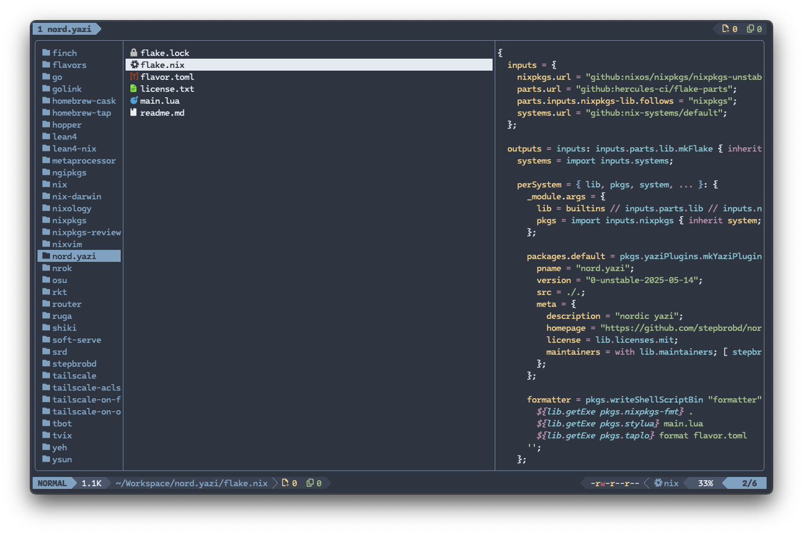

<div align="center">
  
</div>

<h3 align="center">
	Nord Flavor for <a href="https://github.com/sxyazi/yazi">Yazi</a>
</h3>

## Preview



## Installation

```sh
ya pack -a stepbrobd/nord
```

## Usage

Set the content of your `theme.toml` to enable it as your _dark_ flavor:

```toml
[flavor]
dark = "nord"
```

Make sure your `theme.toml` doesn't contain anything other than `[flavor]`,
unless you want to override certain styles of this flavor.

See the
[Yazi flavor documentation](https://yazi-rs.github.io/docs/flavors/overview) for
more details.

For Yatline:

```lua
require("yatline"):setup({
    theme = require("nord"):setup(),
})
```

Nix users:

```nix
# inputs.nord.url = "github:stepbrobd/nord.yazi";

{ inputs, pkgs, ... }:

let
  # required in both `plugins` (reads `main.lua`)
  # and
  # `flavors` (reads `flavor.toml`)
  nord = inputs.nord.packages.${pkgs.stdenv.system}.default;
in
{
  programs.yazi = {
    enable = true;

    plugins = with pkgs.yaziPlugins; {
      inherit nord yatline;
    };

    flavors = { inherit nord; };

    theme.flavor = {
      light = "nord";
      dark = "nord";
    };

    initLua = /* lua */ ''
      require("yatline"):setup({
        theme = require("nord"):setup(),
      })
    '';
  };
}
```

## License

The flavor is MIT-licensed. Check the [LICENSE](LICENSE) for more details.
